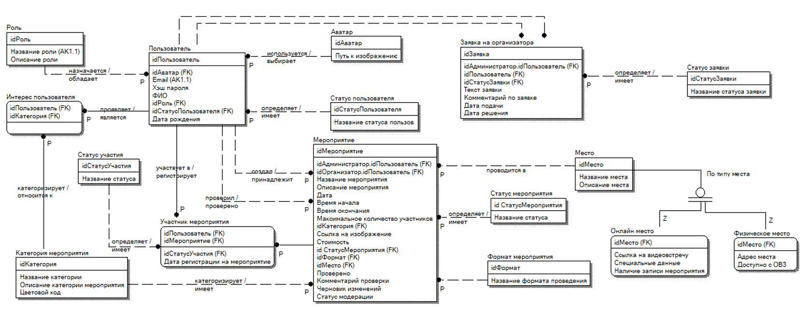
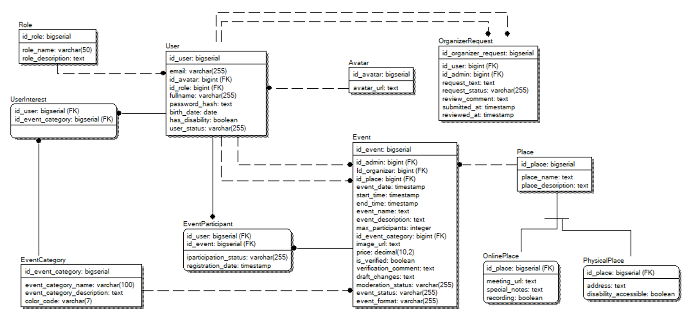
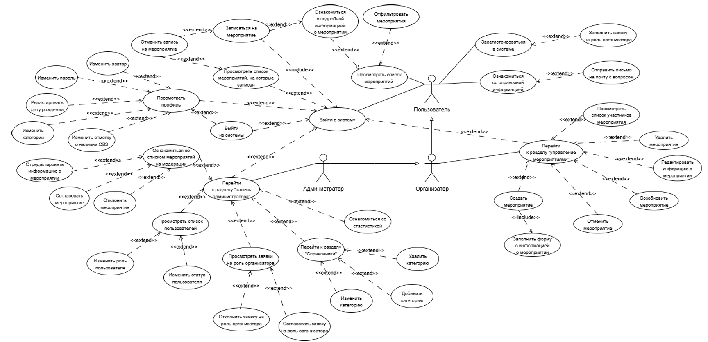
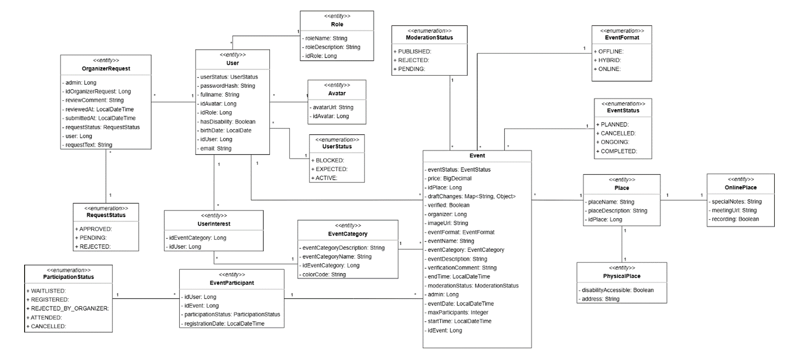

# Курсовой проект: «Организация досуга молодёжи»

> Web-приложение для поиска, организации и управления молодёжными мероприятиями.

---

## Описание проекта

Цель – разработать информационную систему, которая помогает структурировать данные о культурно-массовых и образовательных событиях, упрощает запись участников и автоматизирует учёт. Платформа рассчитана на три роли:

- **Пользователь** просматривает мероприятия, фильтрует по категориям и формату, записывается, управляет профилем.
- **Организатор** создаёт и редактирует свои мероприятия, видит список участников.
- **Администратор** модерирует заявки на роль организатора, проверяет мероприятия, управляет справочниками и пользователями.

---

## Технологический стек

| Компонент          | Технология                                |
|--------------------|-------------------------------------------|
| **Серверная часть**| Java 17, Spring Boot, Spring Data JPA, Spring Security |
| **Клиентская часть**| TypeScript, Angular                       |
| **База данных**    | PostgreSQL (с использованием enum-типов)  |
| **Сервер приложений** | Встроенный Apache Tomcat (в составе Spring Boot) |
| **Сборка**         | Maven                                     |
| **IDE**            | IntelliJ IDEA Enterprise                  |

---

## Архитектура

Приложение построено по **трёхзвенной клиент-серверной архитектуре**:

- **Клиент** (Angular) отображает интерфейс и отправляет HTTP-запросы.
- **Сервер приложений** (Spring Boot) содержит бизнес-логику, обрабатывает запросы, взаимодействует с БД.
- **СУБД** (PostgreSQL) хранит данные.

Взаимодействие происходит по протоколу HTTP. Серверная часть развёртывается как единый исполняемый JAR-файл со встроенным Tomcat.

---

## Модель данных

### Логическая модель

Основные сущности:

- **Мероприятие** (`Event`) – название, описание, время, организатор, статус, формат, место, категория.
- **Пользователь** (`User`) – ФИО, email, пароль, дата рождения, статус, роль, аватар.
- **Участник мероприятия** (`EventParticipant`) – связь пользователя с мероприятием + статус участия.
- **Заявка на организатора** (`OrganizerRequest`) – текст заявки, статус, комментарий администратора.
- **Интерес пользователя** (`UserInterest`) – связь пользователя с категорией мероприятия.
- **Категория мероприятия** (`EventCategory`) – название, описание, цвет.
- **Место** (`Place`) – абстрактная сущность, наследники: `PhysicalPlace` (адрес, доступность) и `OnlinePlace` (ссылка, запись).

Справочные статусы (участия, мероприятия, формата, заявки, пользователя) реализованы как **enum-типы** в PostgreSQL.

>   
> *Рис. 1 – Логическая модель (аналог рис. 1 в пояснительной записке)*

### Физическая модель

В физической модели статусы вынесены в типы перечислений, что упрощает структуру и гарантирует целостность данных на уровне СУБД.

>   
> *Рис. 2 – Физическая модель (аналог рис. 2)*

---

## Диаграммы UML

### Диаграмма вариантов использования

Актёры: **Пользователь**, **Организатор**, **Администратор**.

Основные сценарии:
- Просмотр каталога, фильтрация, запись на событие.
- Управление профилем, выбор категорий интересов.
- Создание/редактирование мероприятий (для организатора).
- Модерация заявок и контента (для администратора).

>   
> *Рис. 3 – Диаграмма вариантов использования (аналог рис. 4)*

### Диаграмма классов

Показаны основные сущности (JPA-классы) и связи между ними.

>   
> *Рис. 4 – Диаграмма классов (аналог рис. 5)*

---

## Запуск проекта

### Требования
- Java 17
- Maven
- PostgreSQL (создайте базу, например, `youth_leisure`)
- Установите Node.js и Angular CLI (для клиента)

### Настройка базы данных
В файле `application.properties` укажите свои параметры:
```properties
spring.datasource.url=jdbc:postgresql://localhost:5432/youth_leisure
spring.datasource.username=your_user
spring.datasource.password=your_password
spring.jpa.hibernate.ddl-auto=update